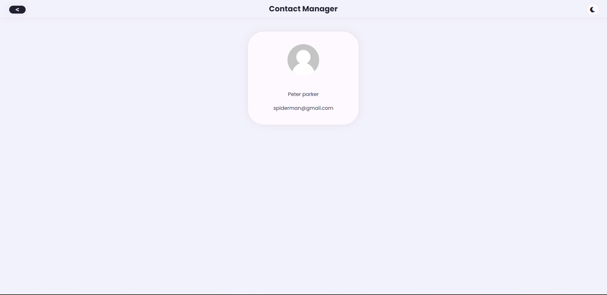
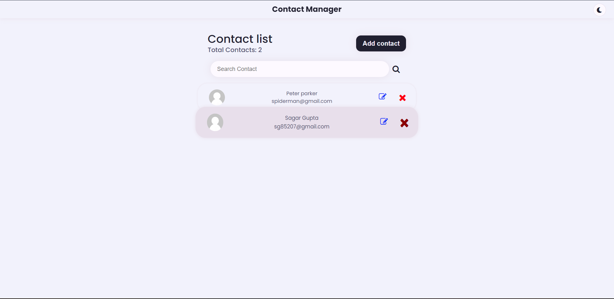

## Project Images






**Contact Management Web Application - MERN Stack**

## Overview
This repository contains the code for a contact management web application built using the MERN (MongoDB, Express.js, React, Node.js) stack. The application includes features such as contact import, pagination, filtering, and contact download.

## Features
1. **Contact Listing:**
   - User-friendly interface displaying imported contacts.
   - Pagination for easy navigation (10 contacts per page).
   - Fields include contact name, phone number, email, and additional relevant information.

2. **Contact Import:**
   - Import contacts from both CSV and Excel files.
   - Validate file formats and display error messages for invalid files.
   - Trigger import process with a button or UI element.
  
3. **Contact Filtering:**
   - Intuitive filtering mechanism allowing users to apply multiple filters.
   - Filters include date of creation, name, phone number, country code, and more.
   - Instant feedback on filtered results.

4. **Contact Download:**
   - Select one or more contacts for download in Excel format.
   - User-friendly selection mechanism.
   - Trigger download process with a button or UI element.

## Backend Development
- Node.js server using Express.js to handle API requests.
- RESTful APIs for contact import, filtering, and download functionalities.
- Logic to parse and process imported CSV and Excel files.
- MongoDB database to store imported contacts.

## Frontend Development
- User-friendly and responsive contact listing UI built with React.
- Pagination controls for easy navigation.
- Intuitive filtering mechanism for applying multiple filters.
- Selection mechanism for contact download.

## Deployment
1. **Backend Deployment:**
   - Deploy the Node.js server to a suitable platform (e.g., Heroku).
   - Set up the MongoDB database and configure the connection.

2. **Frontend Deployment:**
   - Deploy the React app to a suitable platform (e.g., Netlify, Vercel).
   - Update API URLs in the frontend to match the deployed backend.

## How to Run Locally
1. Clone this repository:
   ```bash
   git clone https://github.com/your-username/contact-management-app.git
   cd contact-management-app
   ```

2. Install dependencies:
   ```bash
   cd client
   npm install
   cd ../server
   npm install
   ```

3. Run the backend server:
   ```bash
   cd server
   node index.js
   ```

4. Run the React app:
   ```bash
   cd client
   npm start
   ```

5. Open your browser and visit http://localhost:3000 to see the contact management app.

## Additional Notes
- Test the functionality with various datasets to ensure compatibility.
- Follow industry-standard practices for handling data, file uploads, and implementing features.
- Feel free to customize the application based on specific requirements.

**Note:** Ensure that all features work seamlessly together for an improved user experience.
